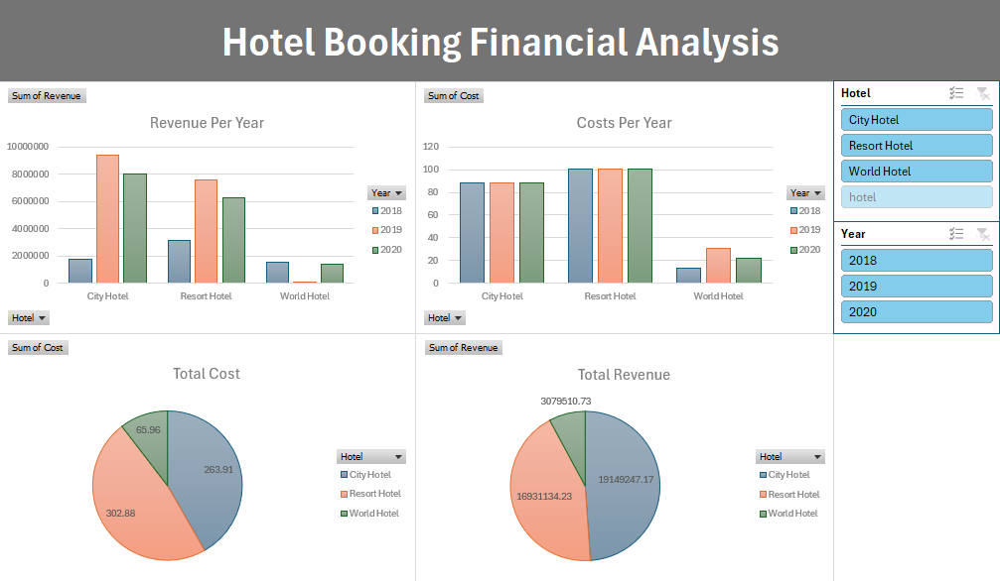

# Hotel Booking Financial Analysis

## Project Overview

This data analysis project aims to understand and evaluate the financial performance (revenue and costs) of hotel bookings across different years and hotel types. The project involved stages of importing raw data, transforming and processing it using SQL, and then visualizing the results through an interactive dashboard created in Microsoft Excel.

## Tools Used

* **Microsoft Excel:** For initial data management and building the interactive dashboard.
* **SQL Server Management Studio (SSMS):** For importing data, merging datasets, and processing with SQL queries.

## Key Execution Steps

1.  **Data Processing:** Imported raw booking data (2018-2020) and meal cost data into SQL Server. Merged datasets and calculated total revenues and costs using a SQL query.
2.  **Dashboard Design:** Imported the processed data into Excel and built an interactive dashboard (using PivotTables, PivotCharts, and Slicers) to monitor hotel financial performance.

## Key Insights

* **Revenue & Cost Distribution:** Understanding each hotel type's contribution to overall revenue and costs.
* **Time-Series Analysis:** Observing changes in financial performance over the years.
* **Performance Comparison:** Comparing revenue and costs among `City Hotel`, `Resort Hotel`, and `World Hotel`.

## How to Reproduce

1.  Import your raw Excel data files into SQL Server.
2.  Execute the project's SQL query (located in "Hotel_Financial_Analysis_Query.sql") to generate the final processed data.
3.  Use Microsoft Excel to build the dashboard based on the extracted data.
